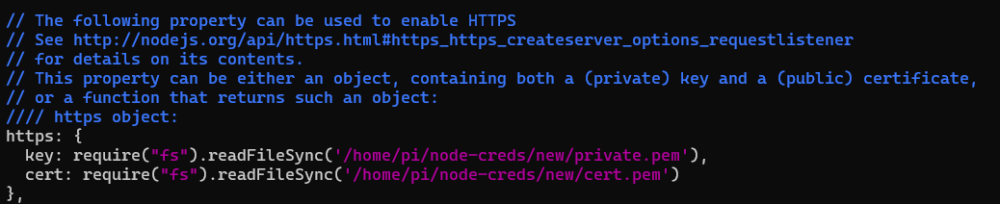

# Raspberry Pi -- Home Automation

### Simple project focussed on automating home switches using a robust and virtually no code requiring framework (sandbox environment) of Node RED build on Node.js
### We (my brother and myself) built this project on Raspberry Pi 4B (1GB RAM) and used Node RED on it.


### Screenshots in "images" folder

##

### Safety first
Cron Job was used for keeping a check on temperature of Pi every 2 minutes. If it exceeded 60 degrees, then stop node red server and all user cron jobs, and then sleep (not suspend, but wait) for 5 minutes for pi to cool down. Afterwards reverse the steps to restart node red and cron jobs for the user (here, "pi"). Temperature limit 60 is used although the limit is around 80. Also there's no fan on the pi, if there would have been one, the temperature wouldn't rise more than 45 for this task (tested using my pedestal fan :wink:). Do your research.

The script for this can be found in [temp_check.sh](temp_check.sh) file.

```shell
crontab -e
*/2 * * * * bash <path to script>/temp_check.sh
```

##

### Node RED setup
The flows are stored in json format. You just need to import them and get going after a few more steps... :upside_down_face:

- Download and install node red modules
    * using easy method - MANAGE PALLETE
    * using npm install <package name>

- Speech Recognition module setup --- 2 options (again)
    * use Google Cloud API -- using Cloud Credits
    * use Mozilla's Deepspeech -- COMPLETELY OFF THE GRID, offline speech recognition that can run on your very own pi using tflite model
  but here again you need to trade between accuracy and privacy :confused:

- Create your own RSA keys and a cerificate for using **https** on node red, **without which microphone won't work on browser** and enable the https option in ~/.node-red/settings.js with the correct path to your private key and certificate (in pem format). Just a tip -- you can install that certificate in your device to remove that untrusted warning. 

- And lastly modify the flows to fit your requirements.

##

### Hardware required (used by me), use your favourite ones
- One relay board (4 in 1)
- Audio output like analog speakers with external amplification
- and raspi of course.

##

### Credits
- **[Bluetooth automatic pairing and trusting - Circuit Digest article](https://circuitdigest.com/microcontroller-projects/diy-raspberry-pi-bluetooth-speaker)**
- You can use **node-red-contrib-speakerpi** node instead of what is used in flows (node-red-contrib-speaker), Olaf Hahn has updated his repo for speakerpi to support the new Node.js modules and fixed some UUID problem (**[GitHub Issue](https://github.com/O-Hahn/node-red-contrib-speakerpi/issues/9)**)
- And the rest of the Open Source Community supporting Node RED.

##

### Note: 
### - Node.js 10 is used with the latest Node RED by modifying the Node RED install script that installed the latest version of Node js and removing the previous versions. 
### - Installed bluez and pulseaudio on the Raspbian Buster Lite (for no DE adn more efficiency), and set the audio profile to A2DP sink. You can find online tutorials to do so.
### - And be SURE to UPDATE THE PATHS FOR FILES!

##

## --- THAT'S IT FROM OUR SIDE ---
